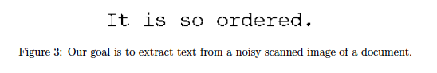

# CSCI-B 551 Assignment 3 - Probability, NLP, and Computer Vision
by Kommalapati A., Sadeghi H., Bhandari J.

Note: Please see [README.pdf](README.pdf) in case latex formulae does not load

## Part 1: Parts-of-speech tagging

Let us go over the problem statement once again:
> What to do. Your goal in this part is to implement part-of-speech tagging in Python, using Bayes networks.
> 1. To get started, consider the simplified Bayes net in Figure 1(b). To perform part-of-speech tagging, we'll want to estimate the most-probable tag $s^*_{i}$ for each word $W_i$,
> 
>  $$
> s_i^*=\arg \max _{s_i} P\left(S_i=s_i \mid W\right) .
> $$
> &emsp; &emsp; Implement part-of-speech tagging using this simple model.
>
> 2. Now consider Figure 1(a), a richer Bayes net that incorporates dependencies between words. Implement Viterbi to  nd the maximum a posteriori (MAP) labeling for the sentence,
> $$
> \left(s_1^*, \ldots, s_N^*\right)=\arg \max _{s_1, \ldots, a_N} P\left(S_i=s_i \mid W\right)
> $$
> 3. Consider the Bayes Net of Figure 1c, which could be a better model because it incorporates richer dependencies between words. But it's not an HMM, so we can't use Viterbi. Implement Gibbs Sampling to sample from the posterior distribution of Fig 1c, $P(S|W)$. Then estimate the best labeling for each word (by picking the maximum marginal for each word, $s_i^*=\arg \max _{s_i} P\left(S_i=s_i \mid W\right)$. (To do this, just generate many (thousands?) of samples and, for each individual word, check which part of speech occurred most often.)

### Simple model

- As given in the problem statement, we implemented the simplified Bayes net by computing the most-probable tag $s^*_i$ for each word $W_i$ using the emission probabilities.
  
### Hidden Markov Model (HMM) with the Viterbi algorithm

- We initialize the DP matrix with parts-of-speech in the rows and the words in the columns.
- The occurence of the parts-of-speech tag corresponding to the first column of the DP matrix is calculated by multiplying the starting probability and the emission probability, followed by setting the previous value to 1.
- The rest of the columns are filled by calculating the max probability of occurrence of a parts-of-speech tag by multiplying the row prior with the transition probability from the previous state to the next state and then taking the maximum value, followed by setting the previous state.
- The DP matrix is then backtracked to get the list of (hidden) parts-of-speech for the observed words of the sentence.
- If a word is non-existent in the training set, the parts-of-speech is set to 'noun' (this gave us maximum performance).

### Complex MCMC (Gibbs sampling)

- All tags of the initial sample are set to noun.
- The burn-in period is set to 100 iterations (out of a total of 500 iterations).
- We check the following for every sample generated:
  - If the given sample is the first word in the sentence then we muliplied the starting probability with the emission probability $P(W_i|S_i)$.
  - If the given sample is the last word in the sentence then we multiplied $P(W_i|S_i)$ with transition probabilities $P(S_i|S_{i-1})$, and $P(S_i|S_{i-1}, S_{i-2})$.
  - If the given sample is the penultimate word in the sentence then we multiplied $P(W_i|S_i)$ with transition probabilities $P(S_i|S_{i-1})$, $P(S_i|S_{i-1}, S_{i-2})$, and $P(S_{i+1}|S_i)$.
  - Else, we multiplied $P(S_i, S_{i-1})$, $P(S_i|S_{i-1}, S_{i-2})$, $P(S_{i+1}|S_i)$, and $P(S_{i+2}|S_{i+1}, S_i)$.
- After the burn-in period, the 5 newest samples are checked if they are the same, and if so, the newest sample is returned, stopping sample generation.

### Calculating the logorithm of the posterior probabilities of a sentence

- **Simple** - The sum of the logs of $P(W_i|S_i)$.
- **HMM (Viterbi)** - The sum of the logs of $P(W_i|S_i)$, $P(S_i, S_{i-1})$, and the starting probabaility of the first label.
- **Complex MCMC (Gibbs sampling)** - The sum of the logs of $P(W_i|S_i)$, $P(S_i|S_{i-1})$, and $P(S_i|S_{i-1}, S_{i-2})$
- We assume the emission and transition probabilities of a newly encountered word to be **1e-8**.

### Performance on the test set

```
==> So far scored 2000 sentences with 29442 words.
                   Words correct:     Sentences correct: 
   0. Ground truth:      100.00%              100.00%
         1. Simple:       92.91%               43.15%
            2. HMM:       95.70%               58.10%
        3. Complex:       90.64%               37.40%
```

## Part 2: Reading text

- Let us go over the problem statement once again:
>  Our goal is to recognize text in an image – e.g., to recognize that Figure 2 says “It is so ordered.” But the images are noisy, so any particular letter may be difficult to recognize. However, if we make the assumption that these images have English words and sentences, we can use statistical properties of the language to resolve ambiguities.
> 
> 
>
> Figure 3: Our goal is to extract text from a noisy scanned image of a document.
> 
> We'll assume that all the text in our images has the same  xed-width font of the same size. In particular, each letter  ts in a box that's 16 pixels wide and 25 pixels tall. We'll also assume that our documents only have the26 uppercase latin characters, the 26 lowercase characters, the 10 digits, spaces, and 7 punctuation symbols, `(),.-!?'"`. Suppose we're trying to recognize a text string with n characters, so we have n observed variables (the subimage corresponding to each letter) $O_1, \ldots, O_n$ and $n$ hidden variables, $L_1, \ldots, L_n$, which are the letters we want to recognize. We're thus interested in $P\left(l_1, \ldots, l_n \mid O_1, \ldots, O_n\right)$. As in part 1, we can rewrite this using Bayes' Law, estimate $P\left(O_i \mid l_i\right)$ and $P\left(l_i \mid l_{i-1}\right)$ from training data, then use probabilistic inference to estimate the posterior, in order to recognize letters.
>
>What to do. Write a program called image2text.py that is called like this:
> ```python
> python3 ./image2text.py train-image-file.png train-text.txt test-image-file.png
> ```
### Calculating probabilities

- We compute the initial, transition and emission probabilities by iterating over all characters in the training set:
  - We compute initial probabilities by calculating the number of times a character is present at the beginning.
  - The transition probability is a dictionary that has character as the key and the value f, each character's value is a dictionary containing the number of times each character comes after this specific character
  - The emission probabilities are calculated by iterating through the test letters and computing the number of matched and unmatched pixels followed by raising custom weights to the matched and unmatched pixels and multiplying them.

### Hidden Markov Model with the Viterbi algorithm

- We implement the Viterbi algorithm to find the corrent order of words
- For start letters of test letters we fill the DP matrix with the sum of the negative log of the emission probabilities of the current letter from train letters and the negative logarithm of the initial probability of the current letter from the train letters.
- For the remaining letters, we find the maximum previous transition probabilities, take its negative logarithm and add it to the negative logarithm of the transition probability of the current letter from the training letters.
- We then take the minimum value to get the maximum a posteriori estimation (due to the negative logarithm).

### Performance on a test sample

```bash
❯ python3 ./image2text.py test_images/courier-train.png ../Part1/bc.test test_images/test-3-0.png
Simple: Together with No. 14-562, Tanco et al. v. Haslam, Governor of
   HMM: Together with No. 14-562, Tanco et al. v. Haslam, Governor of
```